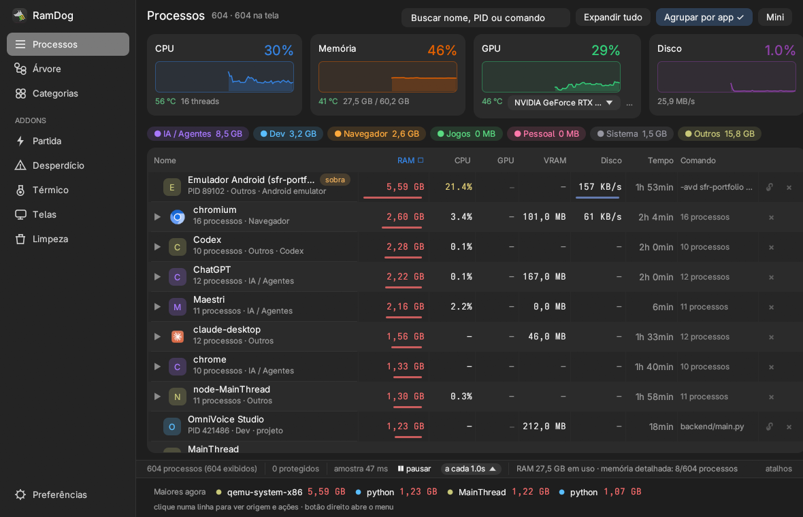

<p align="center">
  
</p>

# RamDog v0.10.0 — interface nova e Limpeza

Esta versão muda a cara do RamDog e ganha um addon. A tela principal deixa de ser cinco fileiras de controle em cima de uma tabela de treze colunas: vira barra lateral, cabeçalho, quatro cards de recurso com histórico e uma tabela de linha dupla. O addon **Limpeza** junta o que sobrou rodando sem ninguém usar com o que está ocupando disco sem precisar.

Por baixo, ela carrega tudo da 0.9.1 e da 0.9.2, que não chegaram a ser publicadas: o sampler Linux que aguenta sessão longa, a identidade da tarefa (Steam/Proton, projeto, agente), VRAM e estado na lista e o encerramento que não mente. A última release publicada era a v0.9.0.

O alvo de referência continua sendo [Omarchy](https://omarchy.org/) — Arch com Hyprland, UWSM e Quickshell.

## Interface

- **Barra lateral** com Processos, Árvore e Categorias, e embaixo os addons: Partida, Desperdício, Térmico, Telas e Limpeza. Preferências no rodapé da barra. Ícones desenhados a traço, iguais no Windows e no Linux.
- **Cabeçalho** com o nome da visão, a contagem ("604 · 229 na tela"), busca, Expandir/Recolher, Agrupar por app e Mini.
- **Cards de recurso**: CPU, Memória, GPU e Disco, cada um com gráfico dos últimos 90 segundos, temperatura e o detalhe (threads, GB usados, VRAM, taxa de disco). O seletor de GPU mora dentro do card.
- **Tabela de linha dupla**: ícone do app ou a inicial num quadrado da cor da categoria; nome na primeira linha, "PID · categoria · origem" na segunda; chip de estado só quando importa (em foco, sobra, zombie, protegido, lock). As colunas Cat., PID, Estado e Origem viraram esse texto; ordenar por elas fica no botão direito. As barras de RAM, GPU e disco viraram um traço fino no pé da célula.
- **Preferências** numa janela: métrica da coluna de memória, cortes de RAM/CPU/GPU/VRAM, pausar e intervalo.
- **Addons** com o mesmo vocabulário: linhas em caixa, botões em pílula, badges de estado, sem heading duplicado.
- Paleta em cinzas neutros (janela `1e1e1e`, barra `242424`, card `2b2b2b`) com o azul do GNOME. No Linux, usa Adwaita Sans e Adwaita Mono quando instaladas (o Omarchy traz); senão, a fonte padrão.
- A largura mínima da janela completa sobe de 900 para 1000 px. O modo Mini não muda.

## Limpeza (Linux)

- **RAM**: uso, cache do kernel e swap lidos de `/proc/meminfo`; "Soltar cache do kernel" (`sync` + `drop_caches` + `compact_memory`) pede senha.
- **Processos**: apps acima de um corte de RAM (100 MB por padrão), agrupados como na lista. Sobras e zombies primeiro, quem tem janela aberta por último. Marca e encerra de uma vez, com o mesmo lock e proteção da lista. Zombie não recebe sinal: a linha aponta o pai.
- **Disco**: cada subpasta de `~/.cache` acima de 1 MB, lixeira, cache do pacman (`paccache -rk1` e `-ruk0`), journal (`--vacuum-size=64M`), coredumps e pacotes órfãos (`pacman -Qtdq` → `-Rns`). Cada alvo tem confirmação inline.
- O que é do sistema roda em `ramdog --clean-helper <op>` como root via `pkexec`. O helper conhece cinco operações fixas e recalcula os alvos por conta própria; nunca recebe caminho nem nome de pacote por argumento. Symlinks não são seguidos, nem no tamanho nem na remoção.

## Identidade da tarefa e lista (0.9.2)

- Overwatch/Proton deixa de aparecer como um `wine64` só: a chave do grupo é Steam appid, prefixo Wine, projeto (venv) ou agente, não o path do runtime. Emulador Android nomeado pelo AVD.
- Colunas VRAM e o estado (em foco, janela, fundo, sobra, zombie). Sobra só com evidência: zombie ou emulador com `-qt-hide-window`.
- Cortes "ocultar abaixo de" para CPU, GPU e VRAM, independentes da RAM. Com Agrupar por app, o corte vale no total do app.
- Encerrar: ESRCH vira "já tinham saído", não falha vermelha. Clique em PID morto avisa. F5 e o próprio encerramento descongelam a tabela.
- GPU `–` deixa de significar zero: ausência de leitura do driver é distinta de carga ~0%. A soma do grupo usa o máximo entre PIDs.
- A coluna Comando de processos Wine não corta mais no primeiro `.exe`.

## Sampler Linux (0.9.1)

- A coleta lê `/proc` direto: threads não entram na lista, o descritor de `stat` não fica aberto, o que não muda é lido uma vez por `(pid, starttime)`. Antes, o `sysinfo` vazava milhares de descritores e a lista mentia depois de algumas horas.
- CPU por processo com média móvel de 1 s, em % da máquina, mesmo com afinidade restrita.
- USS/PSS com teto por ciclo e cache de 5 s; sem `smaps`, o privado usa `RSS − shared`. Leitura ausente aparece como `—`, nunca como 0.
- DRM por processo só abre `/dev/dri`, ignora NVIDIA (coberta pelo `nvidia-smi pmon`) e nem começa sem AMD/Intel.
- Hyprland 0.55+: float com `enable` / `disable`; o segundo encaixe continua flutuando.
- Famílias de agentes (Claude, Codex, Grok, ChatGPT, Cursor, Gemini, Hermes, Maestri, OpenCode) viram uma linha só, recolhida, mesmo com instalações versionadas.

## Instalação

Linux e macOS:

```sh
curl -sSfL https://raw.githubusercontent.com/LucasOl1337/RamDog/main/install.sh | sh
```

No Omarchy e no restante do Linux, use `ramdog-launch` nas próximas aberturas. Para instalar sem abrir: `RAMDOG_NO_LAUNCH=1`. Para fixar a versão: `RAMDOG_VERSION=v0.10.0`. A configuração em `~/.config/RamDog/` é preservada; a visão salva continua valendo.

Windows x64 (PowerShell):

```powershell
irm https://raw.githubusercontent.com/LucasOl1337/RamDog/main/install.ps1 | iex
```

Downloads: `RamDog-linux-x86_64.tar.gz`, `RamDog-linux-aarch64.tar.gz`, `RamDog-macos-aarch64.tar.gz`, `RamDog-macos-x86_64.tar.gz` e `RamDog-windows-x64.zip`. O instalador Unix verifica SHA-256.

## Limites e validação

Limpeza é só Linux por enquanto; no Windows e no macOS o botão fica desabilitado. Telas exige Hyprland; serviços exigem systemd. As ações com senha da Limpeza (pacman, journal, coredumps, órfãos, cache do kernel) precisam de um agente polkit na sessão; o Omarchy shell tem um. Sensores/PWM dependem do driver e das permissões; o controle não cobre fans da GPU. macOS mantém o conjunto limitado (lista, árvore, categorias, origem, kill).

A validação local desta versão foi no Omarchy/Hyprland com NVIDIA RTX 4070 Ti SUPER e AMD integrada: build release, suíte de testes, instalador, e as sete visões abertas numa bancada gráfica isolada (Processos, Árvore, Categorias, Partida, Desperdício, Térmico, Telas, Limpeza, Preferências e Mini). O helper root da Limpeza foi testado só no caminho sem privilégio (recusa) e nas operações de usuário (apagar pasta de cache, sem seguir symlink). Windows e macOS têm build e testes em CI; o visual novo não foi conferido a olho nesses dois. A publicação dos pacotes acontece apenas depois do workflow completar testes e builds nas cinco plataformas.

[Changelog](https://github.com/LucasOl1337/RamDog/blob/main/CHANGELOG.md) · [Guia Linux](https://github.com/LucasOl1337/RamDog/blob/main/linux/README.md) · [Mudanças desde v0.9.0](https://github.com/LucasOl1337/RamDog/compare/v0.9.0...v0.10.0)
