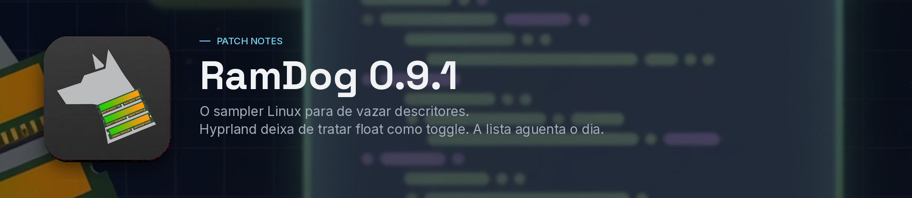

<p align="center">
  
</p>

# RamDog v0.9.1 — estável no Omarchy

Esta versão é o porte Linux aguentando o dia. Na v0.9.0 o RamDog já lia processos, GPU, Partida, Telas e Térmico no Hyprland. Depois de algumas horas, a lista mentia, os descritores estouravam e o CPU do próprio app subia. A 0.9.1 troca o sampler, limita as leituras caras e corrige o float do Hyprland 0.55+.

O alvo de referência continua sendo [Omarchy](https://omarchy.org/) — Arch com Hyprland, UWSM e Quickshell.

## Sampler Linux

O RamDog deixa de usar o `sysinfo` 0.33 no Linux. Essa crate indexava cada thread como processo e mantinha `/proc/*/stat` aberto até metade do rlimit: milhares de descritores, CPU queimada no refresh, RAM e CPU da lista inventados.

Agora a coleta lê `/proc` direto:

- threads não entram na lista; o descritor de `stat` não fica aberto
- o que não muda (exe, cmdline, environ) é lido uma vez por `(pid, starttime)`
- CPU por processo recebe média móvel de 1 s, em % da máquina (100% = todos os núcleos online), inclusive quando o próprio RamDog está com afinidade restrita
- USS/PSS vêm de `smaps_rollup` com teto por ciclo (24) e cache de 5 s; sem essa leitura, o privado usa `RSS − shared` de `statm`, não zero
- descritores de arquivo voltam à ficha, com teto de 80 leituras por ciclo e o mesmo cache
- a fila prioriza o que nunca foi tentado e o mais antigo; erro de permissão entra no cooldown em vez de travar o resto
- leitura ausente ou vencida aparece como `—`, nunca como 0%

A varredura DRM por processo só abre descritores `/dev/dri`, ignora NVIDIA (já coberta pelo `nvidia-smi pmon`) e, se a máquina só tem NVIDIA, nem começa. O worker de GPU espera 1,5 s entre coletas.

## Hyprland / Omarchy

No Hyprland 0.55+ a API Lua trata ação desconhecida de float como *toggle*. O RamDog mandava `set` / `unset`; o segundo encaixe podia devolver a janela ao tiling. Passa a mandar `enable` / `disable`, e o teste de integração aplica o mesmo alvo duas vezes para garantir que a janela continua flutuando.

Hyprland, UWSM e Quickshell continuam protegidos contra encerramento. Telas e uso em primeiro plano exigem sessão Hyprland — no Omarchy, isso é o compositor padrão.

Ao sair do modo Mini, o teto de tamanho da viewport é removido. No X11, só marcar a janela como redimensionável não limpava a restrição de abertura.

## Agrupamento de aplicativos

Instalações versionadas da mesma família — Claude via `mise`, Codex do ChatGPT e do PATH, Grok, Cursor, Gemini, Hermes, Maestri, OpenCode — caem num grupo só. O `node` lançado por um agente herda a família. O grupo começa recolhido; a busca abre os PIDs. Hosts genéricos (`node`, `python`, `bash`) de caminhos diferentes continuam separados, inclusive com diferença de maiúsculas no Unix, para o ✖ do cabeçalho não cruzar projetos.

## Instalação

Linux e macOS:

```sh
curl -sSfL https://raw.githubusercontent.com/LucasOl1337/RamDog/main/install.sh | sh
```

No Omarchy e no restante do Linux, use `ramdog-launch` nas próximas aberturas. Para instalar sem abrir: `RAMDOG_NO_LAUNCH=1`. Para fixar a versão: `RAMDOG_VERSION=v0.9.1`. A configuração em `~/.config/RamDog/` é preservada.

Windows x64 (PowerShell):

```powershell
irm https://raw.githubusercontent.com/LucasOl1337/RamDog/main/install.ps1 | iex
```

Downloads: `RamDog-linux-x86_64.tar.gz`, `RamDog-linux-aarch64.tar.gz`, `RamDog-macos-aarch64.tar.gz`, `RamDog-macos-x86_64.tar.gz` e `RamDog-windows-x64.zip`. O instalador Unix verifica SHA-256.

## Limites e validação

Telas no Linux exige Hyprland; serviços exigem systemd. Sensores/PWM dependem do driver e das permissões; o controle não cobre fans da GPU. Integridade via pacman compara o arquivo com o banco local — não é assinatura digital. macOS mantém o conjunto limitado (lista, árvore, categorias, origem, kill).

A validação local desta preparação incluiu build release Linux, a suíte de testes e o instalador. Três testes de integração opt-in permanecem ignorados por padrão. A publicação dos pacotes deve ocorrer apenas após o workflow completar testes e builds nas cinco plataformas.

A máquina de referência desta série é Omarchy/Hyprland com NVIDIA RTX 4070 Ti SUPER e AMD integrada. Resultados em outros drivers, placas e compositores podem diferir.

[Changelog](https://github.com/LucasOl1337/RamDog/blob/main/CHANGELOG.md) · [Guia Linux](https://github.com/LucasOl1337/RamDog/blob/main/linux/README.md) · [Mudanças desde v0.9.0](https://github.com/LucasOl1337/RamDog/compare/v0.9.0...v0.9.1)
